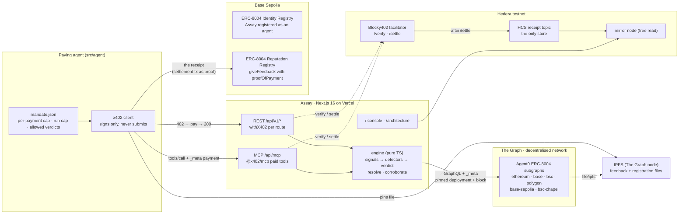

# Architecture

One deployable, one origin, one engine. Everything an agent can pay for is behind
`https://<host>/api`, and everything the service remembers is on a public ledger.

## The read path

1. The agent asks `GET /api/v1/agents/base/25975`. The route answers **402** with x402
   requirements: `hedera:testnet`, an amount in tinybar priced by the work the route does,
   and the facilitator's fee payer.
2. The agent's client signs a payment and retries. `withX402` asks Blocky402 to **verify**,
   runs the handler, and only if the handler succeeded asks it to **settle** — nobody pays for
   an error.
3. The engine reads the Agent0 subgraph through The Graph's gateway. Every query carries
   `_meta`; a response without a pinned deployment hash and block is refused, not returned.
4. Eleven detectors produce a verdict, the evidence, and *what would change it*. Confidence is
   earned only from reviews backed by independent, verifiable payments.
5. After settlement, a receipt lands on the **HCS topic**. That topic — read back over the
   mirror node — is the service's entire memory. There is no database.

## The write path (the receipt)

Reviews are free to write, which is why they are worthless. After the agent has paid Assay
and read the verdict, it writes ERC-8004 feedback about Assay on Base Sepolia whose off-chain
file carries `proofOfPayment: { chainId: 296, txHash: <Hedera settlement> }`. The file is
pinned to The Graph's own IPFS node, because the Agent0 subgraph reads feedback files only
through `file/ipfs` data sources. The next `assay base-sepolia:<assayId>` shows a review with a
payment proof — the loop closes on the same engine that judges everyone else.

## Why it is shaped this way

- **Per-route gating, never middleware.** Next middleware runs on Edge; the Hedera signer needs
  Node. Per-route also means settlement only after success.
- **Serverless, so no in-process state.** MCP runs stateless. The handler → settle-hook hand-off
  is keyed by the signed payment itself and lives for seconds.
- **Adding a chain is a registry row.** `registry/chains.json` lists eight Agent0 deployments;
  six are healthy; the engine refuses to answer from the other two.
- **Two doors, one service.** The REST routes and the MCP tools share the engine, the prices,
  the facilitator and the receipt. Discovery is free on both; evidence costs.

## Coming (Phases G–I)

Arc Nanopayments as a second rail on `/api/arc/v1/*` · Privy treasury wallet with a policy and a
key quorum as the mandate's machine-enforced half · World Selfie Check as the step-up when the
agent wants a larger cap · Bazantic gateway over the OpenAPI document · Uniswap quote in the
pre-flight recipe.
